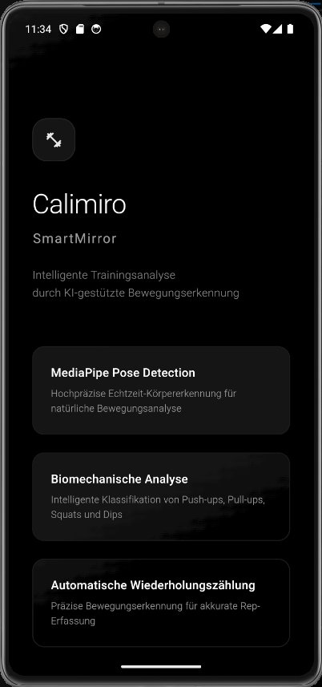
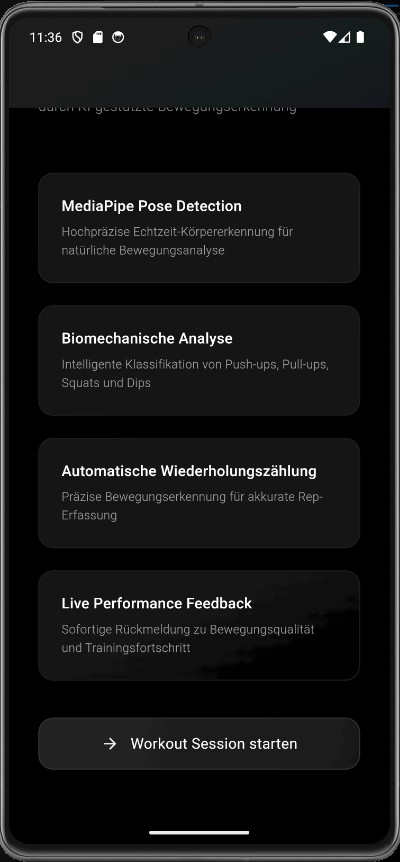
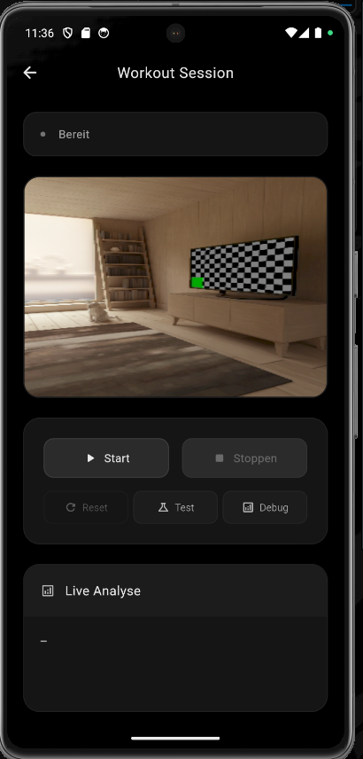
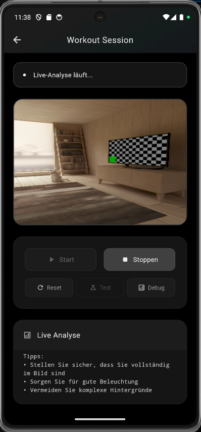

# Calimiro SmartMirror

**Intelligente Trainingsanalyse durch KI-gestützte Bewegungserkennung**

Eine fortschrittliche Flutter-App, die MediaPipe Pose Detection und biomechanische Analyse nutzt, um Workouts in Echtzeit zu erkennen, zu analysieren und Wiederholungen automatisch zu zählen.


## Screenshots

### Homepage - Elegantes Dark Design
<div align="center">
  
  
</div>

*Links: Hauptansicht mit animiertem Logo und Gradient-Design | Rechts: Feature-Übersicht mit detaillierten Beschreibungen*

### Workout Session - Live Analyse
<div align="center">
  
  
</div>

*Links: Kamera-Vorschau mit Live Pose Detection | Rechts: Echtzeit-Analyse mit Übungserkennung und Rep-Counting*

## Features

### **Intelligente Übungserkennung**
- **Push-ups**: Analyse von Arm-Winkeln und Körperhaltung
- **Pull-ups**: Erkennung von Arm-über-Kopf Bewegungen
- **Squats**: Knie-Winkel und Hüftposition Tracking
- **Dips**: Seitliche Armposition und vertikale Bewegungen

### **Fortschrittliche Technologien**
- **MediaPipe Pose Detection**: 33-Punkt Körper-Landmark Erkennung
- **Biomechanische Analyse**: Winkel-basierte Bewegungsklassifikation
- **TensorFlow Lite Integration**: Optional für erweiterte Modell-Inferenz
- **Echtzeit-Verarbeitung**: 30 FPS Kamera-Stream Analyse

### **Performance Analytics**
- **Automatische Rep-Zählung**: Bewegungsintensitäts-basierte Erkennung
- **Live Konfidenz-Scores**: Prozentuale Sicherheit der Klassifikation
- **Performance Metriken**: Inferenz-Zeiten und Erfolgsraten
- **Bewegungsqualität**: Biomechanische Feedback-Systeme

### **Modernes UI/UX Design**
- **Dark Theme**: Elegante monochrome Farbpalette
- **Smooth Animationen**: Sanfte Übergänge und Transitions
- **Responsive Layout**: Adaptive Layouts für verschiedene Bildschirmgrößen
- **Professional Typography**: Sophisticated Font-Hierarchie

## Technische Architektur

### **Frontend Framework**
```yaml
Framework: Flutter 3.0+
Language: Dart 3.0+
UI Kit: Material Design 3
Architecture: State Management with Provider Pattern
```

### **AI/ML Pipeline**
```yaml
Pose Detection: Google ML Kit Pose Detection
Computer Vision: MediaPipe Framework
Model Format: TensorFlow Lite (.tflite)
Inference Engine: Custom MediaPipe Exercise Analyzer
```

### **Core Dependencies**
```yaml
dependencies:
  flutter: sdk: flutter
  camera: ^0.10.6                    # Kamera-Integration
  google_mlkit_pose_detection: ^0.14.0  # Pose Detection
  tflite_flutter: ^0.11.0            # TensorFlow Lite Runtime
  permission_handler: ^11.3.1        # System-Permissions
```

## Installation & Setup

### **Voraussetzungen**
```bash
# Flutter SDK Installation
flutter --version  # Mindestens 3.0.0

# Android Studio / VS Code
# Android SDK (API Level 21+)
# iOS Development (Xcode 12+) - Optional
```

### **Projekt Setup**
```bash
# Repository klonen
git clone https://github.com/calimiro-ai
cd calimiro-smartmirror

# Dependencies installieren
flutter pub get

# Platform-spezifische Assets erstellen
flutter pub run flutter_launcher_icons:main

# TensorFlow Lite Modell hinzufügen (optional)
# Platziere pose_classifier.tflite in assets/models/
```

### **Konfiguration**
```yaml
# pubspec.yaml - Assets konfigurieren
flutter:
  assets:
    - assets/models/pose_classifier.tflite  # Optional für TF Lite
  uses-material-design: true
```

### **Build & Run**
```bash
# Debug Build
flutter run

# Release Build für Android
flutter build apk --release

# Release Build für iOS
flutter build ios --release
```

## Projektstruktur

```
lib/
├── main.dart                          # App Entry Point & Theme
├── pages/
│   └── workout_page.dart              # Hauptseite für Workout-Analyse
├── services/
│   ├── pose_mlkit_service.dart        # ML Kit Pose Detection Service
│   ├── mediapipe_exercise_analyzer.dart # Custom Exercise Classification
│   └── tflite_service.dart            # TensorFlow Lite Integration
└── assets/
    └── models/
        └── pose_classifier.tflite     # Optional: Trainiertes TF Model
```

## AI/ML Implementierung

### **MediaPipe Pose Detection Pipeline**
```dart
// 1. Kamera-Frame Preprocessing
InputImage inputImage = InputImage.fromBytes(
  bytes: cameraImage.planes[0].bytes,
  metadata: InputImageMetadata(...)
);

// 2. Pose Detection
List<Pose> poses = await poseDetector.processImage(inputImage);

// 3. Landmark Extraktion (33 Körperpunkte)
Map<PoseLandmarkType, PoseLandmark> landmarks = pose.landmarks;

// 4. Biomechanische Analyse
double exerciseConfidence = _analyzeExercisePattern(landmarks);
```

### **Übungsklassifikation Algorithmus**
```dart
// Push-up Erkennung
double _analyzePushUps(List<PoseLandmark> landmarks) {
  // Arm-Winkel Berechnung
  double leftArmAngle = _calculateAngle(shoulder, elbow, wrist);
  
  // Körperhaltung (horizontal)
  double bodyAngle = _calculateBodyLineAngle(shoulder, hip);
  
  // Hände unter Schultern
  bool handsUnderShoulders = _areHandsUnderShoulders(...);
  
  return _combineScores([armScore, bodyScore, positionScore]);
}
```

### **Wiederholungszählung**
```dart
// Bewegungsintensität Tracking
double movementIntensity = _calculateMovementIntensity(poseHistory);

// Peak Detection für Rep Counting
if (movementIntensity > threshold && !_inMovement) {
  _detectedReps++;
  _inMovement = true;
}
```

## Performance Optimierung

### **Echtzeit-Verarbeitung**
- **Frame Sampling**: Analyse nur jeden 3. Frame (10 FPS)
- **Asynchrone Inferenz**: Non-blocking Pose Detection
- **Memory Management**: Effiziente Landmark-History Verwaltung
- **Background Processing**: Kamera-Stream auf separatem Thread

### **Genauigkeits-Optimierungen**
- **Glättungs-Algorithmen**: Anti-Flicker für stabile Klassifikation
- **Konfidenz-Schwellwerte**: Mindest-Score 40% für valide Erkennung
- **Temporal Filtering**: 15-Frame Historie für robuste Analyse
- **Fallback-Mechanismen**: Graceful Degradation bei fehlenden Landmarks

## API Referenz

### **MediaPipeExerciseAnalyzer**
```dart
class MediaPipeExerciseAnalyzer {
  // Hauptanalyse-Methode
  Map<String, dynamic> analyzePose(Pose pose);
  
  // Unterstützte Übungen
  static const List<String> exercises = [
    'Push Ups', 'Pull Ups', 'Squats', 'Dips'
  ];
  
  // Rep Counter Management
  void resetReps();
  void clearHistory();
}
```

### **PoseMlkitService**
```dart
class PoseMlkitService {
  // Service Initialisierung
  Future<void> init();
  
  // Pose Detection mit Winkel-Extraktion
  Future<List<double>?> anglesFromCameraImage(
    CameraImage image, 
    {required InputImageRotation rotation}
  );
  
  // Resource Cleanup
  Future<void> close();
}
```

## Roadmap & Future Features

### **Version 2.0**
- [ ] **Erweiterte Übungen**: Lunges, Planks, Burpees
- [ ] **Haltungskorrektur**: Real-time Form Feedback
- [ ] **Workout-Sessions**: Trainingsplan-Integration
- [ ] **Progress Tracking**: Langzeit-Performance Analytics

### **Version 3.0**
- [ ] **Multi-Person Detection**: Gruppen-Workouts
- [ ] **AR Overlays**: Augmented Reality Feedback
- [ ] **Cloud Sync**: Workout-Daten Synchronisation
- [ ] **Social Features**: Leaderboards und Challenges

## Contributing

Wir freuen uns über Beiträge zur Calimiro SmartMirror App!

### **Development Guidelines**
```bash
# Fork & Clone
git clone https://github.com/your-fork/calimiro-smartmirror.git

# Feature Branch erstellen
git checkout -b feature/amazing-feature

# Code Quality sicherstellen
flutter analyze
flutter test

# Pull Request erstellen
```

### **Code Standards**
- **Dart Style Guide**: Offizielle Dart Formatting Rules
- **Flutter Best Practices**: Widget Lifecycle Management
- **Documentation**: Comprehensive Code Comments
- **Testing**: Unit Tests für kritische Funktionen

## Lizenz

Dieses Projekt ist unter der MIT Lizenz veröffentlicht. Siehe [LICENSE](LICENSE) für Details.

```
MIT License

Copyright (c) 2024 Calimiro Team

Permission is hereby granted, free of charge, to any person obtaining a copy
of this software and associated documentation files (the "Software"), to deal
in the Software without restriction, including without limitation the rights
to use, copy, modify, merge, publish, distribute, sublicense, and/or sell
copies of the Software, and to permit persons to whom the Software is
furnished to do so, subject to the following conditions:

The above copyright notice and this permission notice shall be included in all
copies or substantial portions of the Software.
```

## Team & Acknowledgments

### **Core Team**
- **AI/ML Engineering**: MediaPipe Integration & Exercise Classification
- **Mobile Development**: Flutter App Architecture & UI/UX Design
- **Computer Vision**: Pose Detection Optimization & Performance Tuning

### **Special Thanks**
- **Google MediaPipe Team**: Für die exzellente Pose Detection API
- **Flutter Community**: Für Inspiration und Best Practices
- **TensorFlow Team**: Für TensorFlow Lite Mobile Runtime
- **Open Source Community**: Für unschätzbare Tools und Libraries

---

<div align="center">

**[Star uns auf GitHub](https://github.com/your-username/calimiro-smartmirror)** • **[Report Issues](https://github.com/your-username/calimiro-smartmirror/issues)** • **[Contact](lennardgross07@gmail.com)**

</div>
